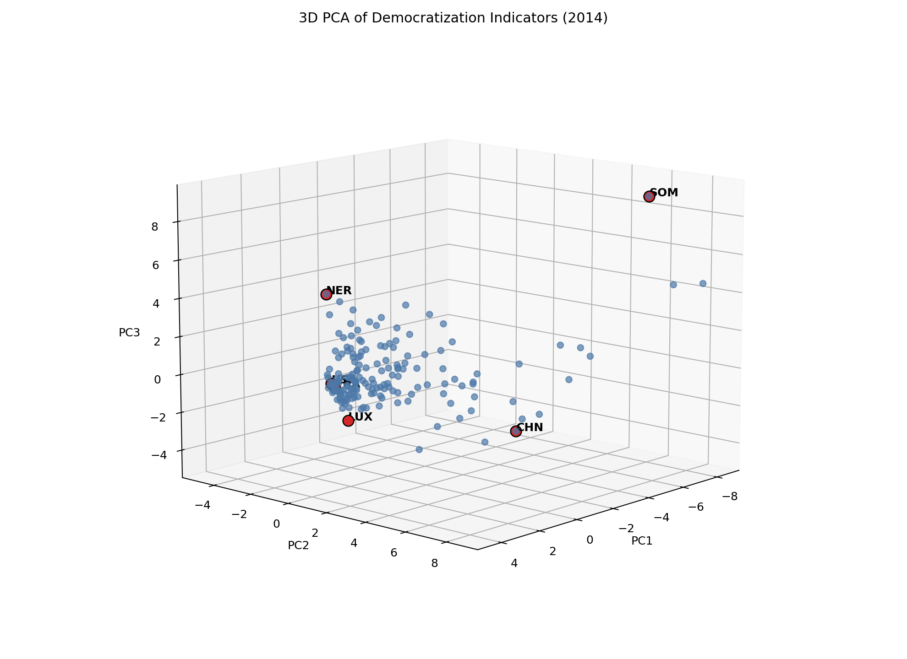

# Democratization PCA Visualization

3D PCA visualization of democratization trajectories across 200+ countries from 1960-2022.



## What This Shows

This project uses principal component analysis to summarize a cross-country democratization dataset into three principal components and visualize country positions in 3D. The reference visualization fits PCA on a cleaned 2014 country-level matrix, then plots countries in the first three principal-component dimensions.

The original class project also explored country trajectories over time by projecting historical country-year observations onto the 2014 PCA basis. The public version keeps the implementation lightweight and reproducible.

## Data

The included CSV, `data/Global_Dataset.csv`, is treated as a public academic/class-project dataset assembled from:

- Andrew T. Little and Anne Meng, "Measuring Democratic Backsliding," and associated Harvard Dataverse replication data.
- World Bank DataBank education and economic indicators.

The dataset combines political, economic, and education indicators by country-year. The repository keeps the CSV because it is small enough for GitHub, but the exact upstream merge process is not reconstructed here.

## Methodology

1. Select political, education, and economic variables relevant to democratization.
2. Convert selected variables to numeric values.
3. Impute sparse slow-moving education/economic variables within each country using nearest-year interpolation.
4. Build a 2014 country-level matrix.
5. Drop variables and countries with more than 40% missing values.
6. Fill remaining missing values with column means.
7. Standardize variables to mean zero and unit variance.
8. Run PCA manually from the covariance matrix using eigen decomposition.
9. Plot the first three principal components in 3D.

## Run Locally

```bash
python3 -m venv .venv
source .venv/bin/activate
pip install -r requirements.txt
python src/main.py
```

The script writes:

```text
outputs/pca_3d_2014.png
```

## Project Structure

```text
.
├── data/
│   └── Global_Dataset.csv
├── outputs/
│   └── pca_3d_2014.png
├── src/
│   └── main.py
├── .gitignore
├── LICENSE
├── README.md
└── requirements.txt
```

## Limitations

- PCA is exploratory and linear; it should not be interpreted as a definitive democracy ranking.
- Results are sensitive to variable selection, missing-data handling, and the reference year.
- The direction/sign of principal components is arbitrary; labels should be interpreted with caution.
- The original combined dataset is included, but the full upstream data-collection and merge pipeline is not included.
- Some countries have sparse data, which can affect their plotted position.

## TODO

- Recreate the full data-assembly pipeline from upstream sources.
- Add a cleaned notebook version if interactive teaching material is needed.
- Add an optional time-trajectory visualization after validating the projection assumptions.
