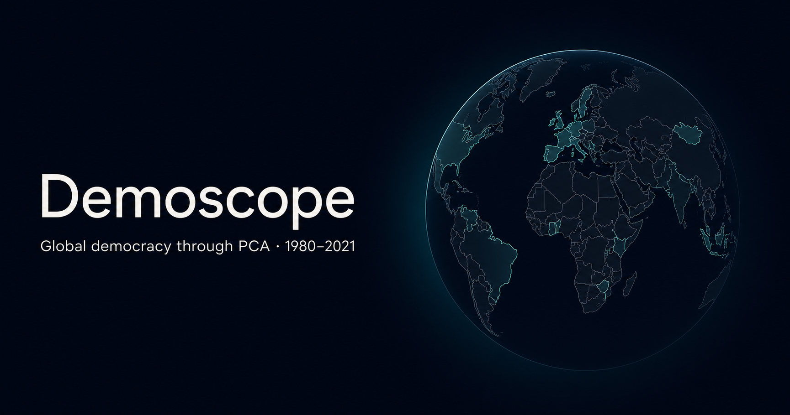
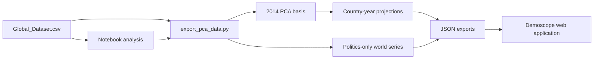

# Demoscope

Interactive visualization of cross-country democratic trajectories derived from principal component analysis (PCA), covering 1980–2021.

**Live visualization:** [demoscope-pca.aware-harp-9471.chatgpt.site](https://demoscope-pca.aware-harp-9471.chatgpt.site)

[](https://demoscope-pca.aware-harp-9471.chatgpt.site)

## Project scope

Demoscope combines the full research workflow in one repository:

- `Global_Dataset.csv`: the country-year source dataset;
- `Project_Python_corrected_v7_global_charts.ipynb`: the analytical notebook;
- `scripts/export_pca_data.py`: a reproducible export pipeline that mirrors the notebook's final specification;
- `web/`: the interactive application and its precomputed JSON data;
- the deployed visualization linked above.

The project uses PCA to summarize a set of political, economic, educational, and press-repression indicators. The first component is oriented so that a higher PC1 score corresponds to a more democratic profile. PC2 and PC3 are retained to show additional dimensions that are lost when the analysis is reduced to a single index.

This is an exploratory measurement project. The PCA scores are not causal estimates, official regime classifications, or substitutes for the underlying indicators.

## What the application shows

- A 3D globe and a 2D map colored by country-level PC1 scores.
- An animated year selector for 1980–2021.
- Country profiles with PC1–PC3 values, period change, PCA neighbors, time series, and 3D trajectories.
- Multi-country comparison charts on a common PCA basis.
- A separate world timeline based on the politics-only PCA specification.
- French and English interfaces.
- A missing-data hatch that distinguishes unavailable or insufficient observations from valid PCA scores.

## Current model summary

| Item | Value |
|---|---:|
| Analysis window | 1980–2021 |
| PCA reference year | 2014 |
| Countries retained in the 2014 cross-section | 170 |
| Variables retained after coverage filters | 27 |
| Variance explained by PC1 | 32.41% |
| Variance explained by PC2 | 12.77% |
| Variance explained by PC3 | 7.54% |
| Cumulative variance, PC1–PC3 | 52.72% |
| PC1 lower tercile threshold, 2014 | −1.3953 |
| PC1 upper tercile threshold, 2014 | 1.7846 |

These figures are generated by `scripts/export_pca_data.py` and stored in `web/public/data/meta.json`.

## Data

Each source row is a country-year observation. The analysis draws on four broad groups of variables.

### Political institutions and competition

Examples include electoral democracy, liberal democracy, election quality, free and fair elections, freedom of expression, freedom of association, inclusive suffrage, opposition participation, party competition, ballot choice, election suspension, executive constraints, and term-limit behavior.

### Economic structure

Examples include taxation, trade openness, agriculture, manufacturing, services, and service-sector employment.

### Education

The source dataset contains adult literacy, tertiary attainment, and primary proficiency indicators. Variables with insufficient coverage are removed by the documented reliability filters before the reference PCA is estimated.

### Press repression

The pipeline includes counts of journalists killed and imprisoned where source coverage is established.

The committed CSV has 13,764 data rows plus its header. It is included to make the notebook and export pipeline reproducible without a separate download step.

## Methodology

### 1. Analysis window and variable typing

The panel is restricted to 1980–2021. Variables are explicitly divided into continuous, binary, ordinal, and count groups. This matters because the same missing-value rule is not valid for every measurement scale.

### 2. Panel-aware treatment of missing values

For supported continuous variables, the pipeline applies:

1. within-country linear interpolation for bounded internal gaps of no more than three consecutive years;
2. regularized low-rank completion for remaining eligible country-year cells;
3. no extrapolation outside a variable's observed temporal support;
4. eligibility requirements based on global coverage, country history, and the number of observed countries per year.

Continuous variables with more than 70% global missingness or fewer than 1,000 observed values are not model-imputed. A country must have at least five observations for low-rank completion. Count variables use zero only in years where the source has established event coverage. The notebook retains audit masks for values filled by the panel model and by the final fallback.

### 3. Reference cross-section

PCA is fitted on the 2014 cross-section because it offers a useful balance between coverage and recency in this dataset. Before the final fallback:

- variables with more than 40% missingness are removed;
- countries with more than 40% missingness across the remaining variables are removed;
- remaining continuous gaps receive the 2014 cross-sectional median;
- remaining binary and ordinal gaps receive the 2014 mode;
- residual covered event-count gaps receive zero.

The resulting reference matrix contains 170 countries and 27 variables.

### 4. Standardization and PCA estimation

Each retained variable is standardized on the 2014 reference distribution:

```text
Z = (X − μ2014) / σ2014
```

The covariance matrix is computed from `Z`, followed by symmetric eigendecomposition. Eigenvalues are sorted in descending order and numerical values below zero are clipped to zero. Scores are obtained by projecting standardized observations onto the first three eigenvectors.

### 5. Component orientation

The sign of a principal component is mathematically arbitrary, so the pipeline applies explicit orientation rules:

- PC1 is oriented so that higher values align with stronger democratic indicators and lower press repression;
- PC2 is oriented so that mature service economies sit on the negative pole of the retained interpretation;
- PC3 is oriented so that China anchors the positive modernized-authoritarian pole used in the notebook.

A sanity check requires the United States to have a higher 2014 PC1 score than China. The orientation rules aid interpretation; they do not change explained variance or relative distances.

### 6. Historical projection

Country-year observations are projected onto the fixed 2014 eigenvectors. The historical data therefore use the 2014 variable means, standard deviations, and PCA basis. This makes trajectories comparable within the model instead of re-estimating a different PCA every year.

Rows with more than 40% missingness are excluded before projection. Remaining supported gaps use year-level statistics where possible and 2014 reference fallbacks otherwise. A `coverage` value is exported for each country-year score.

### 7. Regime groups

The map labels countries using the 33rd and 66th percentiles of the 2014 PC1 distribution:

- `PC1 < −1.3953`: autocracy tercile;
- `−1.3953 ≤ PC1 < 1.7846`: hybrid tercile;
- `PC1 ≥ 1.7846`: democracy tercile.

These are relative groups within the retained 2014 sample, not externally validated regime thresholds.

### 8. World timeline

The world timeline is estimated from a separate politics-only PCA over the panel. It reports the annual median and interquartile range. Its scale is not interchangeable with the main 2014 reference model, so the frontend never splices the main-model series into the politics-only series.

## Data flow



## Repository structure

```text
.
├── Global_Dataset.csv
├── Project_Python_corrected_v7_global_charts.ipynb
├── scripts/
│   └── export_pca_data.py
├── web/
│   ├── app/                  # Sites/vinext application entry points and metadata
│   ├── src/                  # React components, data helpers, maps, charts, and i18n
│   ├── public/data/          # Generated JSON and country geometry
│   ├── public/og.png         # Social preview
│   ├── worker/               # Cloudflare-compatible worker entry point
│   └── package.json
├── requirements.txt
└── CITATION.cff
```

## Reproduce the analysis

Python 3.10 or later is recommended.

```bash
python3 -m venv .venv
source .venv/bin/activate
pip install -r requirements.txt
```

Run the notebook:

```bash
jupyter lab Project_Python_corrected_v7_global_charts.ipynb
```

Regenerate the web exports from the final scripted specification:

```bash
python scripts/export_pca_data.py
```

The export command writes:

- `web/public/data/meta.json`
- `web/public/data/countries.json`
- `web/public/data/scores_by_year.json`
- `web/public/data/world_evolution.json`
- `web/public/data/loadings.json`

`countries.geojson` is the geographic layer used by the 2D and 3D maps and is kept separately from the PCA exports.

## Run the visualization locally

Node.js 22.13 or later is required by the deployment runtime.

```bash
cd web
npm ci
npm run dev
```

Create a production build:

```bash
cd web
npm run build
```

Static PCA outputs are loaded from `web/public/data/`; the browser does not recompute PCA.

## Frontend implementation

The application uses:

- React 19 and TypeScript;
- vinext and Vite for the Sites-compatible application build;
- Tailwind CSS 4 for styling;
- Three.js and `react-globe.gl` for the globe;
- D3 geographic utilities for the flat map;
- Recharts for time-series and comparison charts;
- Framer Motion for transitions;
- a Cloudflare-compatible worker for deployment.

The interface is organized around four main surfaces:

- `App.tsx`: global state, data loading, map mode, timeline, and page routing;
- `GlobeView.tsx` and `FlatMap.tsx`: geographic rendering;
- `CountrySheet.tsx`: country-level diagnostics and trajectories;
- `ComparePanel.tsx` and `AboutPage.tsx`: comparison and methodology views.

## Interpretation and limitations

- PCA is linear and captures variance, not normative importance or causal effects.
- Component interpretation depends on the retained variables, scaling, sample, reference year, and sign orientation.
- The source panel combines observed quantities with constructed political indices; “data-driven” does not mean free of measurement choices.
- Imputation improves panel continuity but adds model-dependent values. Coverage information should be consulted when interpreting early or sparse country-years.
- The 2014 terciles are relative to the retained sample and should not be treated as universal regime cutoffs.
- Historical scores are projections onto a fixed 2014 basis. This improves comparability but assumes that the meaning of the retained dimensions remains sufficiently stable through time.
- The world politics-only timeline and the main country model are different PCA specifications and must remain on separate scales.

## Sources and references

- Little, Andrew T., and Anne Meng. “Measuring Democratic Backsliding.” *PS: Political Science & Politics* (2024). [Article](https://www.cambridge.org/core/journals/ps-political-science-and-politics/article/measuring-democratic-backsliding/9EE2044CDA598BD815349912E61189D8)
- Little, Andrew T., and Anne Meng. *Replication Data for Measuring Democratic Backsliding*. Harvard Dataverse. [Dataset](https://dataverse.harvard.edu/dataset.xhtml?persistentId=doi:10.7910/DVN/G2SQ6Y)
- World Bank. Education and economic indicators accessed through the [World Bank DataBank](https://databank.worldbank.org/).

The repository includes a consolidated working dataset. Users remain responsible for checking the terms, definitions, and citation requirements of each underlying source.

## Author

Oscar Brunel

Bocconi University – HEC Paris, Data, Society and Organisation

[LinkedIn](https://www.linkedin.com/in/oscar-brunel-624657334/) · [Email](mailto:oscar.brunel@studbocconi.it)
