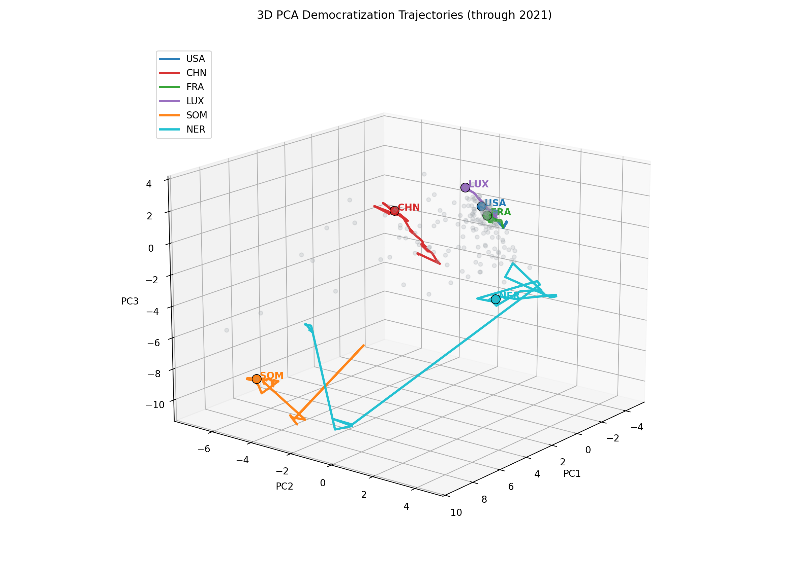

# Democratization PCA Visualization

3D PCA visualization of democratization trajectories using a country-year dataset spanning 1960-2022.



## Overview

This project turns a high-dimensional country-year dataset into an interpretable 3D view of democratization patterns. It was built as a final project for a Python data visualization class and cleaned for public review as a small, reproducible technical portfolio project.

The visualization fits PCA on a cleaned 2014 country-level matrix, then projects historical country-year observations onto the same PCA basis. The result is a 3D plot where selected countries are shown as colored trajectories through the PCA space, while the broader country sample provides context.

The trajectory plot stops at 2021 because the 2022 rows in the combined dataset have insufficient political-variable coverage for a reliable PCA projection.

## What The Visualization Shows

- The gray points show all countries available in the final year of the dataset.
- The colored lines show trajectories for selected countries across time.
- PC1, PC2, and PC3 summarize the largest independent sources of variation across the selected political, education, and economic indicators.
- Historical points are plotted only when at least 50% of the retained PCA variables are observed before final mean imputation.
- The plot is exploratory: it is useful for pattern-finding and comparison, not for claiming a definitive democracy ranking.

## Data

The included CSV, `data/Global_Dataset.csv`, is treated as a public academic/class-project dataset assembled from these source families:

- Andrew T. Little and Anne Meng, "Measuring Democratic Backsliding," and associated Harvard Dataverse replication data.
- World Bank DataBank education and economic indicators.

The dataset combines political, economic, and education indicators by country-year. The repository keeps the CSV because it is reasonably small for GitHub. The full upstream data-collection and merge pipeline is not reconstructed in this public version.

## Methodology

1. Select political, education, and economic variables relevant to democratization.
2. Convert selected variables to numeric values.
3. Impute sparse slow-moving education/economic variables within each country using nearest-year interpolation.
4. Remove aggregate/non-country rows using the dataset's `in_GW_system` country identifier.
5. Build a 2014 country-level matrix.
6. Drop variables and countries with more than 40% missing values.
7. Fill remaining missing values with column means.
8. Standardize variables to mean zero and unit variance.
9. Run PCA manually from the covariance matrix using eigen decomposition.
10. Plot the first three principal components in 3D.
11. Project sufficiently covered historical observations onto the 2014 PCA basis to show country trajectories over time.

## Run Locally

```bash
python3 -m venv .venv
source .venv/bin/activate
pip install -r requirements.txt
python src/main.py
```

The script writes:

```text
outputs/pca_3d_2014.png
outputs/pca_3d_trajectories.png
```

## Project Structure

```text
.
├── data/
│   └── Global_Dataset.csv
├── outputs/
│   ├── pca_3d_2014.png
│   └── pca_3d_trajectories.png
├── src/
│   └── main.py
├── .gitignore
├── LICENSE
├── README.md
└── requirements.txt
```

## Limitations

- PCA is exploratory and linear; it should not be interpreted as a definitive democracy ranking.
- Results are sensitive to variable selection, missing-data handling, and the reference year.
- Principal-component directions and signs are arbitrary; axis labels should be interpreted with caution.
- Historical trajectories are projected onto a 2014 PCA basis, which is useful for visual consistency but is not a full dynamic model.
- The public visualization stops at 2021 because 2022 political indicators are too sparse in the combined file.
- The original combined dataset is included, but the full upstream data-collection and merge pipeline is outside the scope of this repo.
- Some countries have sparse data, which can affect their plotted position.

## TODO

- Recreate the full data-assembly pipeline from upstream sources.
- Add a cleaned notebook version if interactive teaching material is needed.
- Add sensitivity checks for alternative reference years and variable subsets.
